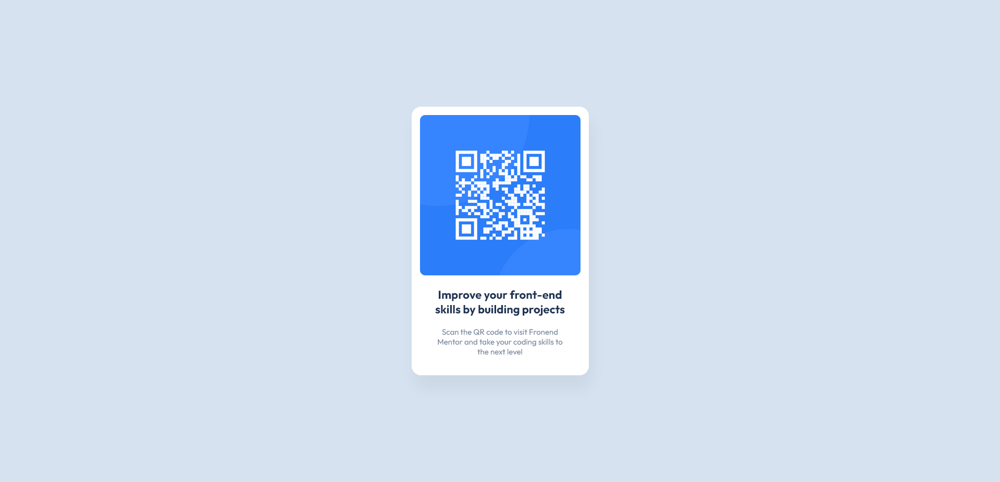

# Frontend Mentor - QR code component solution

This is a solution to the [QR code component challenge on Frontend Mentor](https://www.frontendmentor.io/challenges/qr-code-component-iux_sIO_H). Frontend Mentor challenges help you improve your coding skills by building realistic projects.

## Table of contents

- [Overview](#overview)
  - [Screenshot](#screenshot)
  - [Links](#links)
- [My process](#my-process)
  - [Built with](#Built-with)
  - [Continued development](#continued-development)

## Overview
The challenge is to build out a QR code component and get it looking as close to the design as possible by using any tools I'd like to help me complete the challenge.

### Screenshot

### Links

- Solution URL: [Add solution URL here](https://your-solution-url.com)
- Live Site URL: [Add live site URL here](https://your-live-site-url.com)

## My process
The QR component was build using a mobile-first workflow. The stylesheet was reset and the font size was set to 62.5% to enable greater accuracy when assigning relative values to properties such as font, margin, padding etc. Flexbox was used on the main container to evenly align the component to the center of the screen.
Design specifications where then applied to the relevant elemants to produce the final result.

### Built with

- Semantic HTML5 markup
- CSS custom properties
- Flexbox
- Mobile-first workflow

### Continued development

My next area of focus is building upon my knowledge of layouts using Flexbox as well as additional CSS styling techniques.
